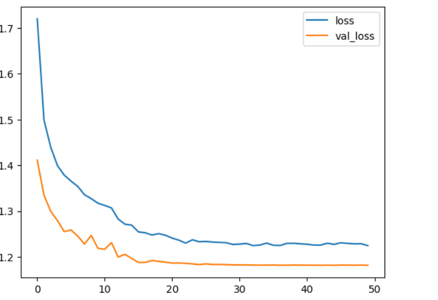
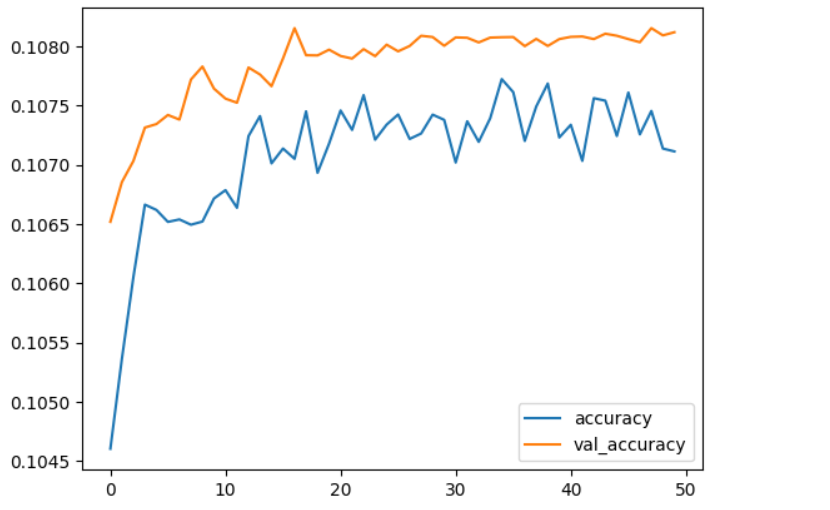

# Implementation-of-Transfer-Learning
## Aim
To Implement Transfer Learning for CIFAR-10 dataset classification using VGG-19 architecture.

## Problem Statement and Dataset
To use the pre-trained VGG19 model on the ImageNet dataset and fine-tune it on the CIFAR-10 dataset. The goal is to achieve high accuracy on the CIFAR-10 dataset by leveraging the knowledge learned from the ImageNet dataset. The main challenge is to adapt the pre-trained model to the new dataset while avoiding overfitting and achieving high accuracy

The CIFAR-10 dataset consists of 60000 32x32 colour images in 10 classes, with 6000 images per class. There are 50000 training images and 10000 test images.

The dataset is divided into five training batches and one test batch, each with 10000 images. The test batch contains exactly 1000 randomly-selected images from each class. The training batches contain the remaining images in random order, but some training batches may contain more images from one class than another. Between them, the training batches contain exactly 5000 images from each class.
the datasetcontains 10 random images of:

airplane										

automobile				

bird					

cat					

deer			

dog		

frog	

horse		

ship			

truck

## DESIGN STEPS
### STEP 1:
Import the required libraries and load the dataset
### STEP 2:

split the dataset for training and testing
### STEP 3:

Set the values of image from 0 t0 1.

### STEP 4:

using the VGG 19 as base model without changing the weights and remove the fully connected layer from VGG19

### STEP 5:

Add our own Fully connected layer to VGG19 base model, compile and fit it

## PROGRAM

#### Import the required libraries
```
import tensorflow as tf
from tensorflow.keras.datasets import cifar10
from tensorflow.keras.applications import VGG19
from tensorflow.keras.models import Sequential
from tensorflow.keras.layers import Dense, Flatten, Dropout
from tensorflow.keras.optimizers import Adam
from tensorflow.keras.callbacks import ReduceLROnPlateau

```
#### Load the dataset and data processing
```
(x_train,y_train),(x_test,y_test)=cifar10.load_data()

x_train = x_train.astype('float32') / 255.0
x_test = x_test.astype('float32') / 255.0

```
#### Create model,compile and fit 
```
base_model  = VGG19(include_top =False, weights ='imagenet')
for layer in base_model.layers:
  layer.trainable = False
ai=Sequential()
ai.add(base_model)
d1= Dense(units =128,activation='relu')
ai.add(d1)
drop=Dropout(rate=0.5)
ai.add(drop)
op=Dense(units=10,activation='softmax')
ai.add(op)

ai.summary()
ai.compile(optimizer=Adam(learning_rate=0.001), loss='sparse_categorical_crossentropy', metrics=['accuracy'])
learning_rate_reduction = ReduceLROnPlateau(monitor='val_accuracy', patience=3, verbose=1, factor=0.5, min_lr=0.00001)
ai.fit(x_train, y_train, batch_size=64, epochs=50, validation_data=(x_test, y_test), callbacks=[learning_rate_reduction])

```
#### Ploting graphs
```
metrics = pd.DataFrame(ai.history.history)
metrics[['loss','val_loss']].plot()
metrics[['accuracy','val_accuracy']].plot()

```
#### Creating Classification report and confusion matrix
```


```
## OUTPUT
### Training Loss, Validation Loss Vs Iteration Plot


### Classification Report

### Confusion Matrix

## RESULT

Thus the implementation of Transfer learning of VGG19 for CIFAR10 dataset is successful.
